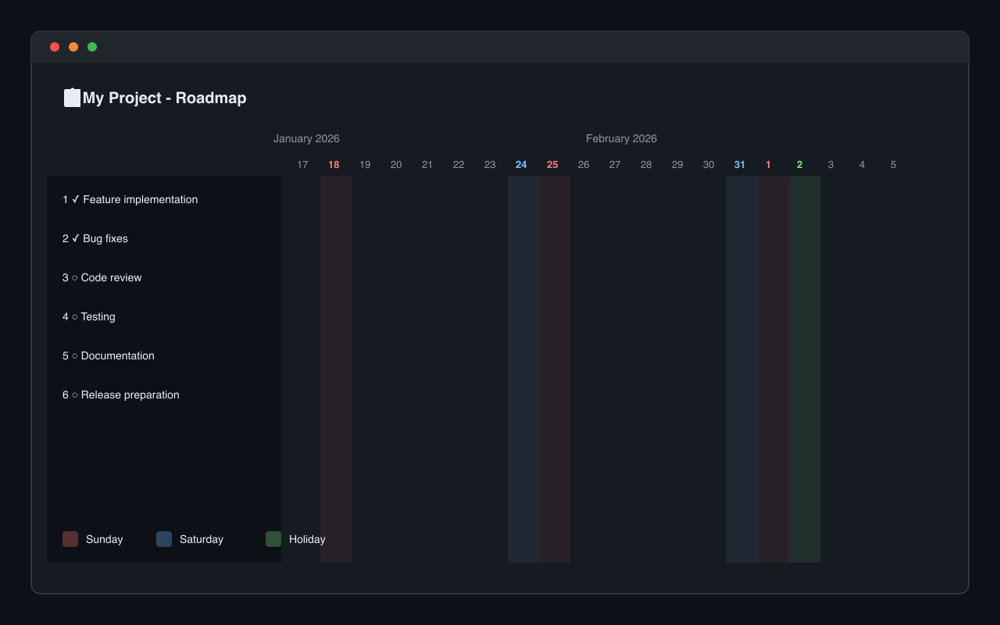

# GitHub Roadmap Weekend & Holiday Highlighter

GitHub Projectsのロードマップビューで土日祝日を色分け表示するChrome拡張機能です。



## 機能

- 🔴 **日曜日** を赤色で表示
- 🔵 **土曜日** を青色で表示
- 🟢 **祝日** を緑色で表示
- 📅 日付ヘッダーの色分け
- 📊 縦ストライプで列全体をハイライト
- 🌙 ダークモード対応

## 特徴

- 日本の祝日に対応（[Holidays JP API](https://github.com/holidays-jp/api)を使用）
- 祝日データは24時間キャッシュで高速動作
- GitHubのデザインを損なわないシンプルな表示
- スクロール時もスムーズに追従

## インストール

### Chrome Web Store（準備中）

<!-- [Chrome Web Storeからインストール](https://chrome.google.com/webstore/detail/...) -->

### 手動インストール（開発者向け）

1. このリポジトリをクローン
```bash
git clone https://github.com/shiramizu-junya/github-roadmap-holidays.git
cd github-roadmap-holidays
```

2. 依存関係をインストール
```bash
npm install
```

3. ビルド
```bash
npm run build
```

4. Chromeで拡張機能をロード
   - `chrome://extensions/` を開く
   - 「デベロッパーモード」を有効化
   - 「パッケージ化されていない拡張機能を読み込む」をクリック
   - `build/chrome-mv3-prod` フォルダを選択

## 開発

```bash
# 開発モード（ホットリロード）
npm run dev

# プロダクションビルド
npm run build

# パッケージ作成（.zip）
npm run package
```

## 対応ページ

- `github.com/*/projects/*` のロードマップビュー

## 技術スタック

- [Plasmo](https://www.plasmo.com/) - Chrome拡張機能フレームワーク
- [React](https://react.dev/) + [TypeScript](https://www.typescriptlang.org/)
- [Holidays JP API](https://github.com/holidays-jp/api) - 日本の祝日データ

## プライバシー

この拡張機能はユーザーデータを一切収集しません。詳細は[プライバシーポリシー](PRIVACY_POLICY.md)をご覧ください。

## ライセンス

MIT License

## 作者

[@shiramizu-junya](https://github.com/shiramizu-junya)
